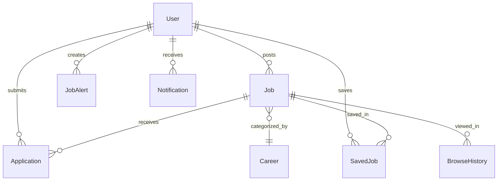
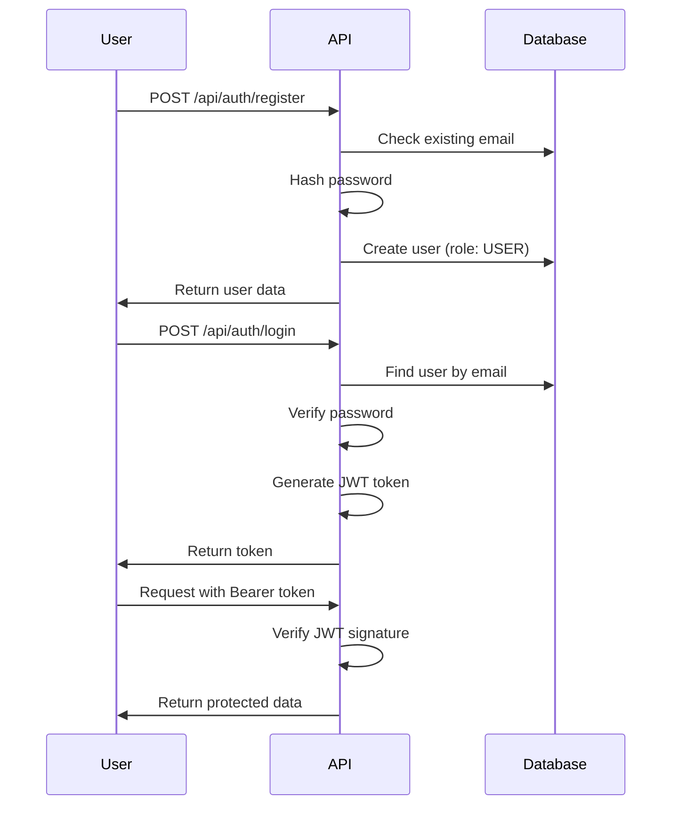

# Green Matchers Backend Architecture

## Overview

**Green Matchers** is an AI-native green-jobs platform for India, built with FastAPI. It connects job seekers with sustainable career opportunities using semantic AI matching, skill-to-career recommendations, and SDG (Sustainable Development Goals) focused job discovery.

---

## Technology Stack

| Layer | Technology | Purpose |
|-------|-----------|---------|
| **Framework** | FastAPI 0.109.0 | High-performance async API framework |
| **Database** | MariaDB + SQLAlchemy 2.0.36 | Relational database with ORM |
| **AI/ML** | Sentence-Transformers 2.3.1 | Semantic embeddings (all-mpnet-base-v2, 768-dim) |
| **Authentication** | JWT (python-jose) + bcrypt | Secure token-based auth |
| **Validation** | Pydantic 2.9.2 | Schema validation and serialization |
| **Server** | Uvicorn | ASGI server |
| **Rate Limiting** | SlowAPI 0.1.9 | Request rate limiting |

---

## System Architecture Diagram

```mermaid
graph TB
    subgraph Client Layer
        Web[React Web App]
        Mobile[Mobile Apps]
    end
    
    subgraph API Layer
        FastAPI[FastAPI Server]
        Routes[API Routes]
        Middleware[CORS + Security Headers]
    end
    
    subgraph Services Layer
        Auth[Authentication Service]
        Jobs[Jobs Service]
        Careers[Careers Service]
        Applications[Applications Service]
        Analytics[Analytics Service]
        
        subgraph AI Services
            Embedding[Embedding Service]
            Matching[Matching Service]
            Search[Search Service]
            Resume[Resume Service]
        end
    end
    
    subgraph Database Layer
        MariaDB[MariaDB]
        Users[Users Table]
        Jobs[Jobs Table]
        Careers[Careers Table]
        Applications[Applications Table]
        Analytics[Analytics Table]
        SavedJobs[Saved Jobs Table]
        JobAlerts[Job Alerts Table]
        Notifications[Notifications Table]
        BrowseHistory[Browse History Table]
    end
    
    Web --> FastAPI
    Mobile --> FastAPI
    FastAPI --> Routes
    Routes --> Middleware
    Middleware --> Services Layer
    Services Layer --> Database Layer
    AI Services --> Embedding
    Embedding --> MariaDB
```

---

## Database Schema

### Core Models

| Model | Table | Purpose |
|-------|-------|---------|
| [`User`](apps/backend/models/user.py) | `users` | All user types (job seekers, employers, admins) |
| [`Job`](apps/backend/models/job.py) | `jobs` | Green job postings with SDG tags |
| [`Career`](apps/backend/models/career.py) | `careers` | Green career paths with required skills |
| [`Application`](apps/backend/models/application.py) | `applications` | Job applications with status tracking |
| [`Analytics`](apps/backend/models/analytics.py) | `analytics` | Platform analytics and insights |
| [`SavedJob`](apps/backend/models/saved_job.py) | `saved_jobs` | User-saved job bookmarks |
| [`JobAlert`](apps/backend/models/job_alert.py) | `job_alerts` | Job search alerts |
| [`Notification`](apps/backend/models/notification.py) | `notifications` | User notifications |
| [`BrowseHistory`](apps/backend/models/browse_history.py) | `browse_history` | Job viewing history |

### Entity Relationships



---

## API Endpoints

### Authentication (`/api/auth`)
| Method | Endpoint | Description |
|--------|----------|-------------|
| POST | `/api/auth/register` | Register new user |
| POST | `/api/auth/login` | Login and get JWT token |

### Users (`/api/users`)
| Method | Endpoint | Description |
|--------|----------|-------------|
| GET | `/api/users/me` | Get current user profile |
| PUT | `/api/users/me` | Update user profile |
| PUT | `/api/users/skills` | Update user skills |
| PUT | `/api/users/preferences` | Update preferences |

### Jobs (`/api/jobs`)
| Method | Endpoint | Description |
|--------|----------|-------------|
| GET | `/api/jobs` | List jobs with filters |
| GET | `/api/jobs/{id}` | Get job details |
| POST | `/api/jobs` | Create job (employer) |
| PUT | `/api/jobs/{id}` | Update job |
| POST | `/api/jobs/{id}/save` | Save job |
| POST | `/api/jobs/{id}/apply` | Apply to job |

### Careers (`/api/careers`)
| Method | Endpoint | Description |
|--------|----------|-------------|
| GET | `/api/careers` | List careers with filters |
| GET | `/api/careers/{id}` | Get career details |
| GET | `/api/careers/recommendations` | Get AI career recommendations |
| GET | `/api/careers/match` | Match skills to careers |

### Applications (`/api/applications`)
| Method | Endpoint | Description |
|--------|----------|-------------|
| GET | `/api/applications` | List user applications |
| GET | `/api/applications/{id}` | Get application details |
| PUT | `/api/applications/{id}/status` | Update application status (employer) |

### Analytics (`/api/analytics`)
| Method | Endpoint | Description |
|--------|----------|-------------|
| GET | `/api/analytics/overview` | Platform overview stats |
| GET | `/api/analytics/career-demand` | Career demand trends |
| GET | `/api/analytics/skill-popularity` | Skill popularity data |
| GET | `/api/analytics/salary-ranges` | Salary distribution |
| GET | `/api/analytics/sdg-distribution` | SDG distribution stats |

### Admin (`/api/admin`)
| Method | Endpoint | Description |
|--------|----------|-------------|
| GET | `/api/admin/users` | List all users |
| PUT | `/api/admin/users/{id}/verify` | Verify employer |
| GET | `/api/admin/jobs/pending` | List pending job verifications |

---

## AI/ML Services

### 1. Embedding Service ([`embeddings.py`](apps/backend/services/ai/embeddings.py))
- **Model**: `sentence-transformers/all-mpnet-base-v2`
- **Vector Size**: 768 dimensions
- **Purpose**: Convert text to semantic vectors for similarity matching
- **Features**: Caching, performance monitoring, error handling

### 2. Matching Service ([`matching.py`](apps/backend/services/ai/matching.py))
- **Algorithm**: Cosine similarity between skill and career embeddings
- **Features**:
  - Skill-to-career matching
  - Matched/missing skills identification
  - Similarity scoring (0.0 - 1.0)

### 3. Search Service ([`search.py`](apps/backend/services/ai/search.py))
- **Features**: Semantic job search using embeddings
- **Purpose**: Find relevant jobs based on natural language queries

### 4. Resume Service ([`resume.py`](apps/backend/services/ai/resume.py))
- **Features**: Resume parsing and skill extraction
- **Purpose**: Extract skills from resume text for profile building

---

## SDG Integration

The platform is built around **17 UN Sustainable Development Goals**:

| SDG # | Goal | Example Careers |
|-------|------|-----------------|
| 7 | Affordable Clean Energy | Solar Technician, Energy Auditor |
| 8 | Decent Work and Economic Growth | Sustainability Consultant |
| 13 | Climate Action | Climate Analyst, Environmental Engineer |
| 12 | Responsible Consumption | Waste Management Specialist |
| 15 | Life on Land | Forest Conservationist |

---

## Authentication Flow



---

## User Roles

| Role | Capabilities |
|------|-------------|
| **USER** | Job search, applications, save jobs, career recommendations |
| **EMPLOYER** | All USER capabilities + post jobs, view applications, manage job listings |
| **ADMIN** | All capabilities + user management, job verification, analytics |

---

## Key Features

### 1. Semantic Job Search
- Natural language job search using AI embeddings
- Filters: location, salary, SDG tags, career category, skills

### 2. AI Career Matching
- Match user skills to career paths
- Identify gaps in required skills
- Recommend relevant careers

### 3. Green Jobs Focus
- SDG tagging for all jobs and careers
- Emphasis on sustainability and environmental impact
- Platform analytics for green job market trends

### 4. Multi-language Support
- User preferred language setting
- Translation helper utility for internationalization

---

## Configuration

Settings are managed via [`config/setting.py`](apps/backend/config/setting.py):

| Setting | Description | Default |
|---------|-------------|---------|
| `DATABASE_URL` | MariaDB connection string | Required |
| `JWT_SECRET_KEY` | JWT signing key | Required |
| `JWT_ALGORITHM` | JWT algorithm | HS256 |
| `ACCESS_TOKEN_EXPIRE_MINUTES` | Token expiry | 10080 (7 days) |
| `EMBEDDING_MODEL` | Sentence transformer model | all-mpnet-base-v2 |
| `CORS_ORIGINS` | Allowed CORS origins | localhost:5173, localhost:3000 |

---

## Project Structure

```
apps/backend/
├── main.py                 # FastAPI application entry point
├── config/
│   └── setting.py          # Application settings
├── core/
│   ├── config.py           # Pydantic settings
│   ├── deps.py             # Dependencies (DB session, auth)
│   ├── exceptions.py       # Custom exceptions
│   ├── security.py         # JWT, password hashing
│   ├── logging.py          # Logging setup
│   └── rate_limit.py       # Rate limiting
├── models/
│   ├── user.py             # User model
│   ├── job.py              # Job model
│   ├── career.py           # Career model
│   ├── application.py      # Application model
│   └── analytics.py        # Analytics model
├── routes/
│   ├── auth.py             # Authentication routes
│   ├── users.py            # User routes
│   ├── jobs.py             # Job routes
│   ├── careers.py          # Career routes
│   ├── applications.py     # Application routes
│   ├── analytics.py        # Analytics routes
│   └── admin.py            # Admin routes
├── schemas/
│   ├── user.py             # User Pydantic schemas
│   ├── job.py              # Job schemas
│   ├── career.py           # Career schemas
│   └── analytics.py        # Analytics schemas
├── services/
│   └── ai/
│       ├── embeddings.py   # Embedding service
│       ├── matching.py     # Matching service
│       ├── search.py       # Search service
│       └── resume.py       # Resume service
└── utils/
    └── db.py               # Database utilities
```

---

## End-to-End Workflow Examples

### Job Seeker Finding a Green Job
1. User registers and sets skills profile
2. User searches for jobs using natural language
3. AI Embedding Service converts query to vector
4. Search Service finds matching jobs
5. User views job details with SDG tags
6. User applies to job
7. Employer reviews application
8. User receives notification of status change

### Employer Posting a Job
1. Employer registers and gets verified
2. Employer creates job posting with SDG tags
3. Job is stored with embedding for semantic search
4. Job appears in search results
5. Employer views and manages applications

### AI Career Recommendation
1. Job seeker provides current skills
2. Matching Service generates skill embeddings
3. Cosine similarity finds matching careers
4. Returns ranked list with matched/missing skills
5. User can see skills gap and learning opportunities

---

## Deployment

The backend can be deployed using:
- **Docker**: [`Dockerfile`](apps/backend/Dockerfile) included
- **Docker Compose**: [`docker-compose.yml`](docker-compose.yml)
- **Nginx**: [`nginx-config.conf`](nginx-config.conf)
- **Systemd**: [`green-matchers.service`](green-matchers.service)
